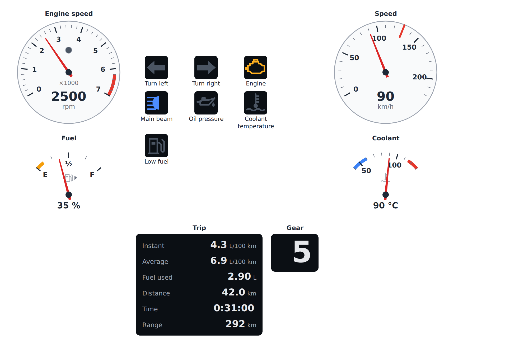

# anywidget-instruments-automotive

Automotive instruments for computational notebooks: speedometer, tachometer, fuel and
temperature gauges, tell-tales, trip computer, gear and shift indicators, and a
head-up display mode.

A **TypeScript front end first**, built on [anywidget](https://anywidget.dev) and on
[anywidget-instruments](https://github.com/AnywidgetInstruments/anywidget-instruments-industrial), whose front
end, trait contract and themes it extends. Everything a widget shows, unit conversion
included, is computed in the front end from its traits, so it behaves alike from
**Python**, **Julia** (KaimonSlate.jl), **Rust** or any host that sets those traits.

> **Status: early implementation.** Every widget of the catalog is written — tell-tales,
> dials, digital displays, the indicators of electric and hybrid drivetrains, and the
> `Cluster` with its head-up display mode — and used
> from Python. Not released yet; see the [roadmap](docs/roadmap.md) and the
> [requirements status](docs/requirements-status.md).

> **Safety.** The widgets are for visualization, teaching, simulation and aftermarket
> dashboards. They are **not vehicle instruments**: not type-approved, and they must not
> replace a vehicle's speedometer, odometer or tell-tales. Read the
> [safety notice](docs/safety.md).

<picture>
  <source media="(prefers-color-scheme: dark)" srcset="docs/img/cluster-preview-dark.png">
  
</picture>

*The cluster example: one `Cluster` of the widgets of this library. The figures are
simulated.*

## Why a separate library

anywidget-instruments follows industrial conventions (ISA-101, IEC 60073). A vehicle
display follows others: tell-tale colours and symbols from UN Regulation No. 121 and
ISO 2575, legibility from ISO 15008, a speedometer that errs on the high side
(UN Regulation No. 39), and glance-time limits against driver distraction. Those belong
in their own package, one that depends on anywidget-instruments rather than bending it.

## Install

Not on the package index yet. From a clone, with Node.js 22 for the front end:

```bash
pip install "anywidget-instruments @ git+https://github.com/AnywidgetInstruments/anywidget-instruments-industrial@293aeea4190979218da5b515b25a1fabedd82901"
npm install && npm run build && pip install -e .
```

## Use

```python
import anywidget_instruments_automotive as aa

rpm = aa.Tachometer(0, max=7000, redline=6000)
speed = aa.Speedometer(0, max=220, unit="km/h")
engine = aa.TellTale("engine", state="off")

aa.Cluster([speed, rpm, engine], hud=False)
```

## Documentation

Published at <https://anywidgetinstruments.github.io/anywidget-instruments-automotive/>; `mkdocs serve` builds it locally from `docs/`:

* [Widget catalog](docs/widgets.md) — what each widget shows and which convention it follows
* [Hosts](docs/hosts.md) — Python, a web page, Julia (KaimonSlate.jl), Rust
* [Development](docs/development.md) — building, testing, the trait contract
* [Safety notice](docs/safety.md)
* [Standards and references](docs/standards.md)
* [Head-up display mode](docs/hud.md)
* [Use with CAN & CANopen Studio](docs/integration.md)
* [Specification](docs/specification.md) — requirements in EARS notation
* [Requirements status](docs/requirements-status.md)
* [Roadmap](docs/roadmap.md) — milestones in order of dependency

## Related projects

| Project | What it is | Documentation |
|---|---|---|
| [anywidget-instruments-industrial](https://github.com/AnywidgetInstruments/anywidget-instruments-industrial) | Instrumentation widgets for notebooks: gauges, tanks, LEDs, switches, charts, alarms, SCADA objects | <https://anywidgetinstruments.github.io/anywidget-instruments-industrial/> |
| [anywidget-instruments-automotive](https://github.com/AnywidgetInstruments/anywidget-instruments-automotive) | Automotive instruments built on anywidget-instruments | <https://anywidgetinstruments.github.io/anywidget-instruments-automotive/> |
| [afm-host-panel](https://github.com/AnywidgetInstruments/afm-host-panel) | Grafana panel plugin that runs anywidget modules, with both libraries built in | <https://anywidgetinstruments.github.io/afm-host-panel/> |

## License

BSD 3-Clause, as anywidget-instruments. See [LICENSE](LICENSE).
